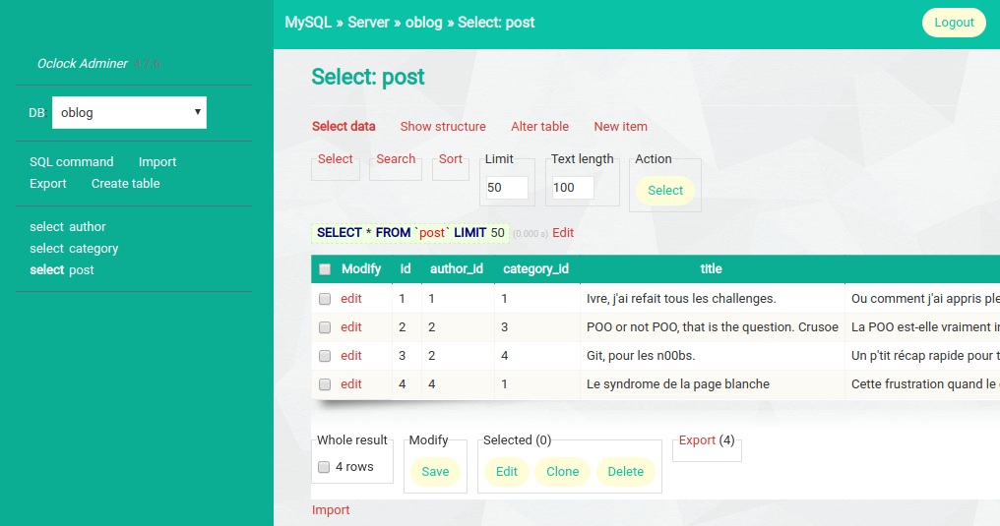

# Adminer for Oclock

Ce dépôt contient les fichiers sources d'adminer avec des plugins utiles et un thème plus sympa que celui par défaut.

## Comment le récupérer ?

Il suffit de cloner ce repo dans le répertoire `/var/www/html` de la VM pour récupérer _Adminer_ et l'utiliser.

## Comment l'utiliser ?

L'URL sera : [http://localhost/adminer/](http://localhost/adminer/)

## A quoi ressemble l'interface ?

